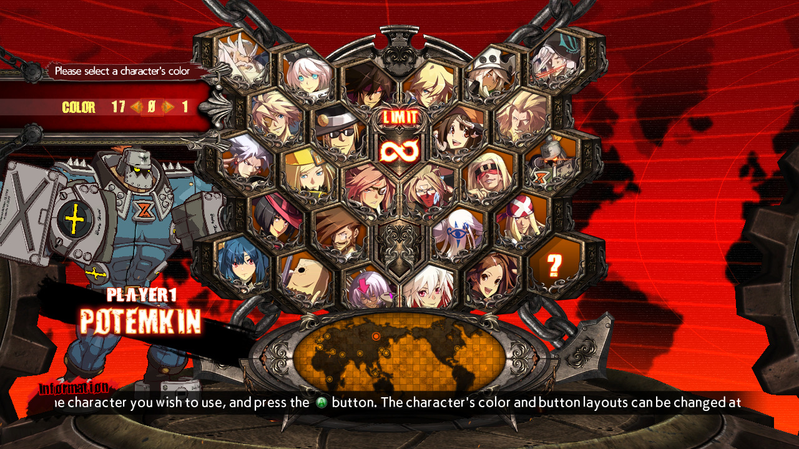

# GGXrdMirrorColorSelect



Adds ability to select the mirror color for any character in Guilty Gear Xrd -REVELATOR- Rev2 version 2211 (works as of 12'th August 2024).

Based on patches and reverse engineering work done by **Worse Than You**. Big thanks to him for making this possible!

## Usage on Windows

Launch GGXrdMirrorColorSelect.exe or GGXrdMirrorColorSelect_32bit.exe and press the **Patch GuiltyGear** button.  
Close the mod.  
Launch Guilty Gear Xrd.  
You don't need to ever launch this mod again.

## Usage on Linux

The launcher provided (launch_GGXrdMirrorColorSelect_linux.sh) only works if your Steam on Linux launches Guilty Gear Xrd through Steam Proton.  
Cd into the directory where `GGXrdMirrorColorSelect.exe` and `launch_GGXrdMirrorColorSelect_linux.sh` files are and give yourself permission to execute the .sh script:

```bash
cd GGXrdMirrorColorSelect
chmod u+x launch_GGXrdMirrorColorSelect_linux.sh
# Launch Guilty Gear first, then script
./launch_GGXrdMirrorColorSelect_linux.sh
```

The .sh script will launch the app's .exe through Wine in the same virtual environment as Guilty Gear Xrd. You may then close Guilty Gear Xrd and press the **Patch GuiltyGear** button.

Steam may start downloading 4GB of stuff and say it's validating something in this game. It will in fact not alter the patched files after it is over, and all the changes will remain.

## Undoing changes if game stopped working

If after pressing the **Patch GuiltyGear** button the game stopped working, you can go into the game installation directory and fine and replace the following files:

- Replace `...\Binaries\Win32\GuiltyGearXrd.exe` with `...\Binaries\Win32\GuiltyGearXrd_backup.exe`
- Replace `...\REDGame\CookedPCConsole\REDGame.upk` with `...\REDGame\CookedPCConsole\REDGame_backup.upk`

This should undo all the changes done by the mod.

## Compilation

To compile, open the .sln file in Visual Studio (I use Visual Studio Community Edition 2022) and press Build - Build Solution. It will say where it compiled the .exe file in the Output panel.

Thie .exe expects `decompress.exe` and `GGXrdRevelator.exe` 3'rd-party tools to be present in the **3rdparty** folder next to it. You may download or compile these tools from the sources listed below. They shall not be part of this repository and are provided in Releases section downloads for convenience only.

## 3'rd-party tools used and credits

Original Unrealscript (in-RAM version) bytecode and .exe patches and all reverse engineering work done by **Worse Than You**.

**decompress.exe** is used to decompress .UPK files. Created by **Gildor**: <https://www.gildor.org/downloads>

**GGXrdRevelator.exe** is used to decrypt Rev2 UPK files. Created by **gdkchan**: <https://github.com/gdkchan/GGXrdRevelatorDec>

**UE Explorer** and its UELib were a huge help in creating the .UPK (disk) version of the patch. Created by **EliotVU** <https://github.com/UE-Explorer/UE-Explorer> and <https://github.com/EliotVU/Unreal-Library>
